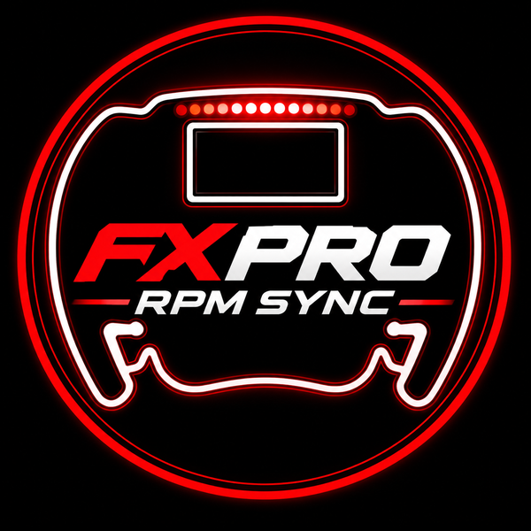

<p align="center">
  <picture>
    <source media="(prefers-color-scheme: dark)" srcset="assets/logo-nobg.png">
    
  </picture>
</p>

# FXPro RPM Sync

A [SimHub](https://www.simhubdash.com/) plugin that keeps the **Simagic FX Pro**'s rev lights matched to the car
you're driving, automatically, in every game.

Out of the box, SimPro Manager uses one set of RPM light thresholds per preset. That means the shift lights are
early in some cars and late in others. FXPro RPM Sync detects each car change in SimHub and pushes that car's real
shift-light pattern, colors and shift point to the wheel through SimPro Manager.

- **Real per-car shift lights** from the community [Lovely Car Data](https://github.com/Lovely-Sim-Racing/lovely-car-data)
  database.
- **Sensible fallback** for cars that aren't in the database: pick a pattern and colors, with animated previews.
- **Per-car overrides** when a car's lights don't match the game, including a nudge from a wheel button while driving.
- **Non-destructive:** your SimPro preset is never saved over. The original lights are restored when SimHub exits.

## Requirements

| | |
|---|---|
| Wheel | Simagic **FX Pro** (tested on an Alpha EVO base). Other Simagic wheels with RPM lights may work but are untested. |
| SimPro Manager | **SimPro Manager 3** (tested with V3.2.2), running while you drive. The plugin talks to its local API on `127.0.0.1:4010`. |
| SimHub | Tested with 9.11. The free version is fine. |
| Game | Must be supported by **both** SimHub (car detection) and SimPro Manager (which drives the LEDs from its own telemetry). |
| Internet | Needed the first time a car is looked up. Car data is cached locally afterwards. |

Why SimPro? The FX Pro has no native SimHub LED support, so the plugin configures the lights through SimPro, and SimPro sends them to the wheel.

## Install

1. Download `FXProRpmSync-vX.Y.zip` from [Releases](https://github.com/ziadkadry99/FXPro-RPM-Sync/releases).
2. **Close SimHub**, then copy `User.FXProRpmSync.dll` from the zip into your SimHub folder
   (default `C:\Program Files (x86)\SimHub\`).
3. Start SimHub. In the **New plugins have been detected** window, turn on the **FXPro RPM Sync** toggle and
   **Show in left main menu**, then click **Ok**.
4. Open **FXPro RPM Sync** in SimHub's left menu.

## Usage

Start SimPro Manager and SimHub, select your usual preset in SimPro, and drive. That's it: on every car change the
settings page shows the car, where its lights came from, and the shift point / max RPM that were applied.

### Cars without rev light data

Cars that aren't in the database get the style you choose under **Cars without rev light data**:

- **Your SimPro preset:** your preset's own pattern and colors, rescaled to the car.
- **Built-in patterns:** left to right, edges to center, blocks of 3, and others, with color schemes (green/yellow/red,
  F1-style green/red/blue, or custom) and an optional solid or blinking flash at the shift point.

For these cars the shift point is SimHub's redline, which is 95% of max RPM unless you set it in SimHub's
**Car Settings**. Setting it there is the quickest fix for one car.

Untick **Use each car's real rev lights** to use your style for every car.

### Per-car overrides

When a car's lights don't match the game, open **Per-car overrides** while driving it (or pick a saved car) and
choose:

| Override | What it does |
|---|---|
| **Shift earlier / later** | Moves the whole sequence and the flash by an RPM offset. |
| **Set each LED** | Sets the RPM and color of each of the 15 LEDs, plus the shift flash, by hand. |
| **Use a pattern** | Applies one of the fallback patterns to this car, keeping the car's own shift point. |

Overrides are saved per game and car and applied automatically.

**Tune while driving:** in SimHub → **Controls and events**, map the actions
`FXProRpmSyncPlugin.CurrentCarLightsLater` / `FXProRpmSyncPlugin.CurrentCarLightsEarlier` to wheel buttons.
Each press moves the current car's lights by 50 rpm and saves it as an override.

### Your SimPro preset

The first time the plugin sees a preset, it stores that preset's RPM lights as the **original**. It restores the
original when SimHub exits, when you untick **Enabled**, or when you press **Restore original preset lights**.
If you edit the preset's RPM lights in SimPro, press **Re-capture preset** so the plugin uses the new version.

### SimHub properties

`FXProRpmSyncPlugin.Status`, `CurrentCar`, `AppliedMaxRpm`, `AppliedRedline`, `LightsSource`, and
`CurrentCarOverride` are available for dashboards.

## How it works

1. SimHub reports a car change (game + car id + max RPM).
2. The plugin looks the car up in Lovely Car Data (exact match, then same series / team if they all share one setup).
   Cars that aren't found get your fallback style.
3. Any per-car override is applied.
4. The result is converted to SimPro's format. SimPro stores LED thresholds as a percentage of the **game max RPM
   SimPro reads for the current car**, so the plugin scales to that. It also snaps thresholds to whole percents and
   colors to SimPro's palette, which is what the FX Pro actually displays.
5. The lights are sent live to the wheel through SimPro Manager's local API (`preset_set_dev_config`), without
   saving the preset.

SimPro's API is undocumented; see [CLAUDE.md](CLAUDE.md) for the reverse-engineered details and the FX Pro behavior
measured on the wheel.

## Troubleshooting

- **Plugin not in SimHub's menu:** check that the DLL is directly in the SimHub folder (not a subfolder) and that
  SimHub was closed while you copied it. If you skipped the enable prompt, turn the plugin and
  **Show in left main menu** on in SimHub's **Settings → Plugins**.
- **"No Simagic wheel found":** make sure SimPro Manager is running and shows the wheel.
- **Everything else:** check `SimHub\Logs\SimHub.txt` for lines starting with `[FXProRpmSync]`, and include them in
  your issue.

## Building from source

Requires the .NET SDK and a SimHub install (the project references SimHub's DLLs).

```
dotnet build -c Release                             # builds and copies the DLL into SimHub (close SimHub first)
dotnet build -c Release -p:DeployToSimHub=false     # build only
```

Set `SIMHUB_INSTALL_PATH` if SimHub isn't in `C:\Program Files (x86)\SimHub\`.

## Contributing

Bug reports and pull requests are welcome.

- **Issues:** [open one](https://github.com/ziadkadry99/FXPro-RPM-Sync/issues) with the game, the car, what the lights
  did versus what you expected, and the `[FXProRpmSync]` log lines.
- **Wrong shift point for a car in the database?** The data comes from Lovely Car Data, so a fix there helps everyone:
  contribute it to [lovely-car-data](https://github.com/Lovely-Sim-Racing/lovely-car-data). Until then, use a per-car
  override.
- **Pull requests:** keep them focused, and describe how you tested them on a wheel. Reports from other Simagic wheels
  are especially welcome.

## License

- **Plugin code:** [GPL-3.0](LICENSE). You can use, modify, and share it; modified versions you distribute must stay
  open source under the same license.
- **Car rev light data:** [Lovely Car Data](https://github.com/Lovely-Sim-Racing/lovely-car-data) by Lovely Sim Racing
  and contributors, licensed [CC BY-NC-SA 4.0](https://creativecommons.org/licenses/by-nc-sa/4.0/). The data isn't
  bundled with this plugin; it's downloaded from the Lovely Car Data repository at runtime. Its non-commercial terms
  apply to the data.

This is an independent community project, not affiliated with or endorsed by Simagic. Simagic, FX Pro, and SimPro
Manager are trademarks of their respective owners.
